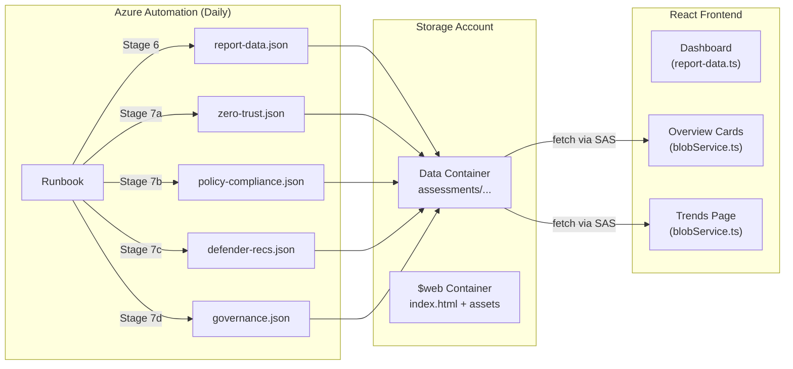

# Runbook ↔ Frontend End-to-End Verification & Fix Plan

## Problem Summary

After a deep-dive analysis of the runbook ([ZeroTrustAssessment-Runbook.ps1](file:///e:/test5/zerotrustassessment/runbooks/ZeroTrustAssessment-Runbook.ps1), 1861 lines) and the React frontend (`src/report/src`), I found **three critical gaps** that prevent the system from working end-to-end, plus several configuration issues. Here's everything, with fixes and deployment instructions.

---

## Architecture Overview



---

## Issue 1 — Missing `tenant-index.json` (Critical)

> [!CAUTION]
> The runbook does NOT produce `tenant-index.json`, but the frontend requires it on every page load.

The `GlobalFilterContext.tsx` calls `fetchTenantIndex()` on mount, which tries to fetch `assessments/tenant-index.json`. This file drives all tenant/subscription/date selection for the Overview Cards and Trends page. Without it, those sections silently fail.

### Fix: Add Stage 6b to runbook

After Stage 6 and before Stage 7, add a new stage that builds and uploads `tenant-index.json`:

#### [MODIFY] [ZeroTrustAssessment-Runbook.ps1](file:///e:/test5/zerotrustassessment/runbooks/ZeroTrustAssessment-Runbook.ps1)

Insert after line 1468 (end of Stage 6):

```powershell
#region ── STAGE 6b: Build and upload tenant-index.json ────────────────
Write-Log "--- STAGE 6b: Building tenant-index.json ---"

$tenantIndex = [ordered]@{
    tenants = @(
        [ordered]@{
            id   = $targetTenantId
            name = $reportJson.TenantName
            subscriptions = @(
                $allSubs | ForEach-Object {
                    [ordered]@{
                        id             = $_.Id
                        name           = $_.Name
                        resourceGroups = @()      # populated per-sub if needed later
                        dates          = @($today) # first run; append logic below
                    }
                }
            )
        }
    )
}

# Merge with existing tenant-index.json to accumulate dates across daily runs
try {
    $existingBytes = $null
    $indexBlobUri  = "https://" + $storageAccountName +
                     ".blob.core.windows.net/" + $containerName +
                     "/assessments/tenant-index.json"
    $readHeaders   = [ordered]@{
        Authorization  = "Bearer $script:StorageBearerToken"
        "x-ms-version" = "2020-04-08"
        "x-ms-date"    = [DateTime]::UtcNow.ToString("R")
    }
    try {
        $existingRaw = Invoke-RestMethod -Method GET -Uri $indexBlobUri `
            -Headers $readHeaders -TimeoutSec 30 -ErrorAction Stop
        if ($existingRaw) {
            $existingIndex = $existingRaw
            # For each subscription in the current run, merge its dates into
            # the existing entry (cap at 90 for bounded growth)
            foreach ($newTenant in $tenantIndex.tenants) {
                $oldTenant = $existingIndex.tenants |
                    Where-Object { $_.id -eq $newTenant.id } | Select-Object -First 1
                if ($oldTenant) {
                    foreach ($newSub in $newTenant.subscriptions) {
                        $oldSub = $oldTenant.subscriptions |
                            Where-Object { $_.id -eq $newSub.id } | Select-Object -First 1
                        if ($oldSub -and $oldSub.dates) {
                            $merged = @($oldSub.dates) + @($today) |
                                Sort-Object -Unique |
                                Select-Object -Last 90
                            $newSub.dates = @($merged)
                        }
                    }
                    # Preserve any subscriptions that existed before but aren't in this run
                    $existingSubIds = @($oldTenant.subscriptions | ForEach-Object { $_.id })
                    $newSubIds      = @($newTenant.subscriptions | ForEach-Object { $_.id })
                    foreach ($oldSub in $oldTenant.subscriptions) {
                        if ($newSubIds -notcontains $oldSub.id) {
                            $newTenant.subscriptions += $oldSub
                        }
                    }
                }
            }
        }
    }
    catch {
        Write-Log "  No existing tenant-index.json -- creating fresh." "WARN"
    }
}
catch {
    Write-Log "  tenant-index.json merge failed -- uploading fresh." "WARN"
}

Upload-JsonBlob `
    -BlobPath       "assessments/tenant-index.json" `
    -Data           $tenantIndex `
    -StorageContext  $ctx `
    -Container       $containerName
Write-Log "tenant-index.json uploaded."

#endregion
```

---

## Issue 2 — `.env` BLOB_BASE_URL Misconfiguration

> [!WARNING]
> The `.env` file points `VITE_BLOB_BASE_URL` at the `$web` container, but data lives in your data container (e.g. `ztdata`).

#### [MODIFY] [.env](file:///e:/test5/zerotrustassessment/src/report/.env)

```diff
-VITE_BLOB_BASE_URL="https://YOUR_STORAGE_ACCOUNT.blob.core.windows.net/$web"
+VITE_BLOB_BASE_URL="https://YOUR_STORAGE_ACCOUNT.blob.core.windows.net/YOUR_DATA_CONTAINER"
 VITE_BLOB_SAS_TOKEN="?YOUR_SAS_TOKEN_HERE"
```

Replace `YOUR_STORAGE_ACCOUNT` with your actual storage account name and `YOUR_DATA_CONTAINER` with the value of your `BlobContainerName` Automation Variable.

> [!IMPORTANT]
> The SAS token needs **Blob Read** (`r`) permission on the data container for the frontend to fetch JSON files. Generate a read-only SAS token scoped to the data container.

---

## Issue 3 — Dashboard Uses Hardcoded Demo Data (Not a Bug — By Design)

The Dashboard page reads from `report-data.ts`, which contains an inline `ZeroTrustAssessmentReport` object. This is the **original design** of the ZeroTrust Assessment tool: `Invoke-ZtAssessment` produces `ZeroTrustAssessmentReport.json`, which gets pasted into `report-data.ts`, the app is built, and the resulting single-file `index.html` is self-contained.

**This is intentional** — the Dashboard shows the full assessment with Sankey diagrams, device configs, compliance policies, etc. from the `Invoke-ZtAssessment` output. The Overview Cards and Trends page separately fetch live data from blob storage.

### How to integrate: Two-step build

1. Runbook runs → uploads `report-data.json` to blob (Stage 6, already done)
2. A **build pipeline step** downloads `report-data.json`, replaces the content in `report-data.ts`, then builds and deploys `index.html`

> [!IMPORTANT]
> If you want fully automated daily dashboard updates, you'll need a CI/CD step that downloads the latest `report-data.json` from blob, injects it into `report-data.ts`, builds the app, and uploads the new `index.html` to `$web`. See the deployment section below.

---

## Data Contract Verification ✅

The runbook output JSON structures are **correctly aligned** with the frontend TypeScript types:

| Runbook Output | Frontend Type | Match |
|---|---|---|
| `zero-trust.json` → `{ tenantId, tenantName, runDate, overallScore, pillars[], checks[] }` | `ZeroTrust` in `assessment.ts` | ✅ Perfect |
| `policy-compliance.json` → `{ runDate, initiatives[] }` with `resources[]` nested | `PolicyCompliance` | ✅ Perfect |
| `defender-recs.json` → `{ runDate, recommendations[] }` | `DefenderRecs` | ✅ Perfect |
| `governance.json` → `{ runDate, rules[] }` | `Governance` | ✅ Perfect |
| `report-data.json` → full `ZeroTrustAssessmentReport` | `ZeroTrustAssessmentReport` in `report-data.ts` | ✅ Perfect |

### History Data Storage ✅

The runbook correctly stores **both** dated and `latest` copies:
- `assessments/{tenantId}/{subId}/{YYYY-MM-DD}/zero-trust.json` — historical
- `assessments/{tenantId}/{subId}/latest/zero-trust.json` — latest
- Same for policy-compliance, defender-recs, governance

The Trends page uses `fetchAllSnapshots()` which iterates over dates from `tenant-index.json`, fetching each date's snapshot. This correctly builds trend history over time.

---

## How to Compile and Deploy the Frontend

### Step 1: Install dependencies (one-time)

```powershell
cd e:\test5\zerotrustassessment\src\report
npm install
```

### Step 2: Update `.env` with real values

Edit `e:\test5\zerotrustassessment\src\report\.env`:

```env
VITE_BLOB_BASE_URL="https://yourstorageaccount.blob.core.windows.net/yourcontainer"
VITE_BLOB_SAS_TOKEN="?sv=2022-11-02&ss=b&srt=o&sp=r&se=2027-01-01&st=2026-01-01&spr=https&sig=YOUR_SIGNATURE"
```

### Step 3: (Optional) Inject latest report data

If you want the Dashboard to show your real tenant data instead of the demo data:

```powershell
# Download the latest assessment report from blob
$sasUrl = "https://yourstorageaccount.blob.core.windows.net/yourcontainer/assessments/report-data.json?YOUR_SAS_TOKEN"
$report = Invoke-RestMethod -Uri $sasUrl

# Read and replace the report-data.ts file
$tsContent = Get-Content ".\src\config\report-data.ts" -Raw
$jsonInsert = ($report | ConvertTo-Json -Depth 30)

# Replace everything after "export const reportData: ZeroTrustAssessmentReport = "
$pattern = '(?s)(export const reportData: ZeroTrustAssessmentReport = ).*$'
$replacement = "`$1$jsonInsert"
$tsContent -replace $pattern, $replacement | Set-Content ".\src\config\report-data.ts" -Encoding UTF8
```

### Step 4: Build the single-file index.html

```powershell
cd e:\test5\zerotrustassessment\src\report
npm run build
```

This outputs `dist/index.html` — a single self-contained HTML file (via `vite-plugin-singlefile`).

### Step 5: Upload to `$web` container

```powershell
# Using Azure CLI
az storage blob upload `
    --account-name yourstorageaccount `
    --container-name '$web' `
    --name index.html `
    --file .\dist\index.html `
    --content-type "text/html" `
    --overwrite

# OR using AzCopy
azcopy copy ".\dist\index.html" "https://yourstorageaccount.blob.core.windows.net/`$web/index.html?SAS_TOKEN" `
    --content-type "text/html"
```

### Step 6: Enable static website hosting

In Azure Portal → Storage Account → **Static website** → Enable → Set `index.html` as the index doc. The URL will be something like:

```
https://yourstorageaccount.z13.web.core.windows.net/
```

### CORS Configuration

Since the frontend is served from `$web` but fetches data from the data container, you need CORS rules on the storage account:

```powershell
az storage cors add `
    --account-name yourstorageaccount `
    --services blob `
    --origins "https://yourstorageaccount.z13.web.core.windows.net" `
    --methods GET HEAD `
    --allowed-headers "*" `
    --exposed-headers "*" `
    --max-age 3600
```

---

## Proposed Changes Summary

### Runbook
#### [MODIFY] [ZeroTrustAssessment-Runbook.ps1](file:///e:/test5/zerotrustassessment/runbooks/ZeroTrustAssessment-Runbook.ps1)
- Add Stage 6b: Generate and upload `tenant-index.json` with tenant/subscription/dates data
- Merge with existing `tenant-index.json` to accumulate historical dates across daily runs (capped at 90 days)

### Frontend Config
#### [MODIFY] [.env](file:///e:/test5/zerotrustassessment/src/report/.env)
- Update `VITE_BLOB_BASE_URL` to point at data container instead of `$web`

---

## Verification Plan

### Automated Verification
1. **TypeScript compilation**: Run `cd e:\test5\zerotrustassessment\src\report && npx tsc --noEmit` — should pass with zero errors
2. **Vite build**: Run `npm run build` — should produce `dist/index.html` without errors

### Manual Verification
1. After applying the runbook changes and running the runbook once:
   - Check that `assessments/tenant-index.json` exists in the blob container
   - Verify it contains the expected structure: `{ tenants: [{ id, name, subscriptions: [{ id, name, resourceGroups, dates }] }] }`
2. After deploying the built `index.html` to `$web`:
   - Open the static website URL in a browser
   - Open DevTools → Network tab
   - Verify `tenant-index.json` is fetched successfully (200)
   - Verify the Overview Cards section loads security posture data
   - Navigate to the Trends page and verify charts populate with snapshot data
3. After a second daily runbook run:
   - Re-check `tenant-index.json` — it should now have 2 dates in the `dates` array
   - The Trends page should show 2 data points
